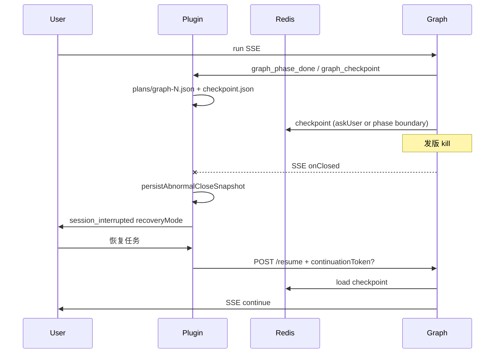

# 会话恢复设计（发版 / SSE 硬断）

> 状态：P0–P2b 已实现（含发版 drain + DB 任务队列）· 2026-05-18  
> 关联：`SessionStore`、`GraphCheckpointStore`（Redis）、`GraphStateStore`（插件本地）

## 1. 问题

| 场景 | 行为 | 恢复能力 |
|------|------|----------|
| **受控中断**（`needs_input` / `AskUser`） | 后端写 Redis checkpoint + `continuationToken`，插件 `applyAwaiting` | **精确续跑**（`intent=answer`） |
| **非受控中断**（发版、网络、进程被杀） | SSE `onClosed`，仅部分 assistant 文本 + 本地 graph 片段 | **尽力继续**（plan/工具摘要，可能重做步骤） |
| **用户新建会话** | 应取消 in-flight SSE，清空 UI | 不恢复旧会话 |

发版属于非受控中断：服务端 Graph 内存态丢失，除非已在 Redis/本地落盘。

## 2. 恢复模式（产品口径）

| `recoveryMode` | 条件 | UI 文案 | Resume API |
|----------------|------|---------|------------|
| `exact` | 存在 `continuationToken`（Redis 或本地 graph/checkpoint） | 可从断点恢复 | `intent=answer` 或带 token 的 resume |
| `soft` | 有 `checkpoint.json` / plan / 消息，但无 token | 尽力继续（计划与进度已保存，部分步骤可能重做） | `intent=continue` + digest |
| `none` | 空会话 | 不展示恢复条 | — |

**注意**：`hasCheckpoint=true` 仅表示本地有 `checkpoint.json`（含工具步快照），**不等于**可精确续跑。

## 3. 分阶段实施

### P0 — 产品预期（已实现）

- `session_interrupted` 增加 `recoveryMode`、`hasContinuationToken`
- WebUI 恢复横幅按模式区分文案；`soft` / `exact` 均展示「恢复」按钮

### P1a — 异常关闭落盘（已实现）

插件 `onClosed` 时：

1. `GraphStateStore.snapshot()` → 写入 `checkpoint.json`（含 `continuationToken` 若有）
2. `assessRecovery()` 计算 `recoveryMode`
3. 与「新会话 abort SSE」逻辑配合，避免旧流回写 UI

### P1b — 阶段边界 checkpoint（已实现）

后端 `CommitAction` 每完成一个 phase：

1. `GraphPhaseCheckpointSaver` 将 `OverAllState` 写入 Redis（token=`phase:{sessionId}:{phaseId}`）
2. SSE `graph_checkpoint` → 插件 `GraphStateStore.applyCheckpoint` 持久化 token

发版时若刚完成某 phase，仍可能从 Redis 恢复该边界（TTL 24h）。

### P2a — 发版 drain（已实现，与 Helm/systemd 联动）

滚动发版时每个 Pod：

1. **preStop** `POST /actuator/drain`（Helm `deployment.yaml`）
2. **就绪探针** `deployDrain` → `OUT_OF_SERVICE`，Service 不再分配新流量
3. **拒绝新 run** `DeployDrainFilter` → 503 + `Retry-After`（客户端可打其他副本）
4. **停止进行中 run** Redis `StopSignalBus` + SSE `done(deploy_draining)`
5. **SIGTERM** `DeployDrainShutdownHook` 再次 drain（与 preStop 幂等）
6. **插件** 收到 `deploy_draining` → `persistAbnormalCloseSnapshot` + `session_interrupted`（`exact`/`soft` 恢复条）

配置：`codepilot.deploy.drain.*`（`application.yml`）；运维脚本 [`scripts/deploy/drain-pod.sh`](../scripts/deploy/drain-pod.sh)。

| 组件 | 文件 |
|------|------|
| Drain 编排 | `DeployDrainService.java` |
| 活跃 run 登记 | `RunLifecycleRegistry.java` + `ConversationService.trackSession` |
| Graph 停流 | `GraphEngineService` + `StopSignalBus` |
| 发版入口 | `DeployDrainEndpoint` (`/actuator/drain`) |
| K8s | `helm/templates/deployment.yaml` preStop |

**发版操作**：`helm upgrade`（`maxUnavailable: 0` 逐 Pod 替换）；裸机 `systemctl stop` 触发 SIGTERM drain。详见 [`DEPLOY.md`](../DEPLOY.md) §9.1。

### P2b — 可重启任务队列（已实现）

Agent + Graph 模式（`codepilot.conversation.queue.enabled=auto` 且 V10 表存在时）：

1. `POST /run` → `conversation_runs` 入队 + 首条 SSE `run_started{runId}`
2. `ConversationRunWorker` 在本 Pod 或 **Reclaimer** 在其它 Pod 认领执行
3. SSE 事件写入 `conversation_run_events` + Redis pub/sub
4. 发版 drain → run `interrupted` → 其它 Pod reclaim → 插件 `GET /runs/{id}/stream` 自动续接（`deploy_draining` 时触发）

| API | 说明 |
|-----|------|
| `POST /v1/conversation/run` | 队列模式返回 `run_started` + 事件流 |
| `GET /v1/conversation/runs/{id}/stream?afterSeq=` | 重放 + 订阅（发版后续流） |
| `GET /v1/conversation/runs/{id}/status` | 运维 / 插件取 `lastSeq` |

Chat 模式与 `policy.engine=legacy` 仍走内联 SSE（不经队列）。

## 4. 数据流

## 5. 关键文件

| 文件 | 职责 |
|------|------|
| `SessionStore.kt` | `assessRecovery`, `persistAbnormalCloseSnapshot` |
| `CefChatPanel.kt` | `dispatchSessionInterrupted`, `abortActiveConversation` |
| `GraphStateStore.kt` | `applyCheckpoint` |
| `GraphPhaseCheckpointSaver.java` | phase 边界 Redis + SSE |
| `CommitAction.java` | 调用 saver |
| `ChatMainArea.tsx` | 恢复横幅文案 |
| `legacyChatBridge.ts` | `recoveryMode` 状态 |

## 6. 验收

1. 对话进行中杀后端 → 插件显示「尽力继续」或「从断点恢复」（若刚 askUser）
2. 点击恢复 → resume 请求带 token（exact）或 continue（soft）
3. 发版中点「新对话」→ 空白会话，旧 SSE 不再灌入
4. phase 完成后杀进程 → Redis 存在 `phase:*` key（运维可查）
