# CodePilot Graph Engine 深度剖析

> 基于 `GraphEngineService` 及其关联 Action 的完整运行机制、流转逻辑、记忆体系、上下文工程与 Prompt 工程分析。

---

## 1. 整体架构概览

Graph Engine 是 CodePilot 后端的核心编排引擎，基于 Spring AI Alibaba Graph（LangGraph 的 Java 移植）实现。它将一次对话请求编排为有向图的节点执行流程，通过 `StateGraph` 声明式定义节点和条件边，编译后按请求驱动执行。

### 1.1 核心组件关系

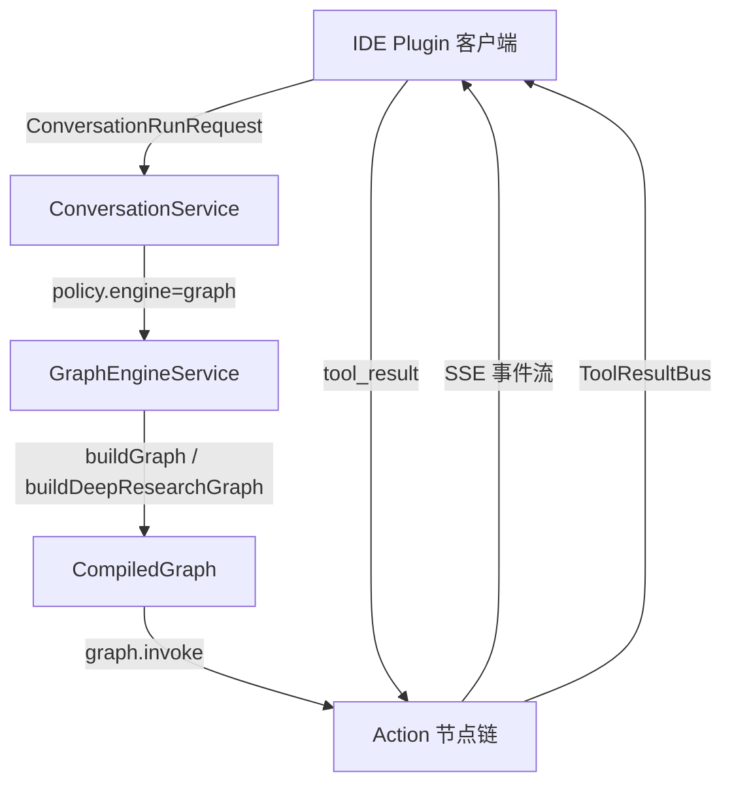

### 1.2 两种图拓扑

| 模板 | 方法 | 用途 |
|------|------|------|
| `default` | `buildGraph()` | 通用编码/Agent 任务 |
| `deep-research` | `buildDeepResearchGraph()` | 深度研究（搜索→评估→综合） |

选择逻辑：`req.policy().graphTemplate()` 为 `"deep-research"` 时使用研究图，否则使用默认图。

---

## 2. 默认图（Default Graph）节点与流转

### 2.1 完整节点拓扑

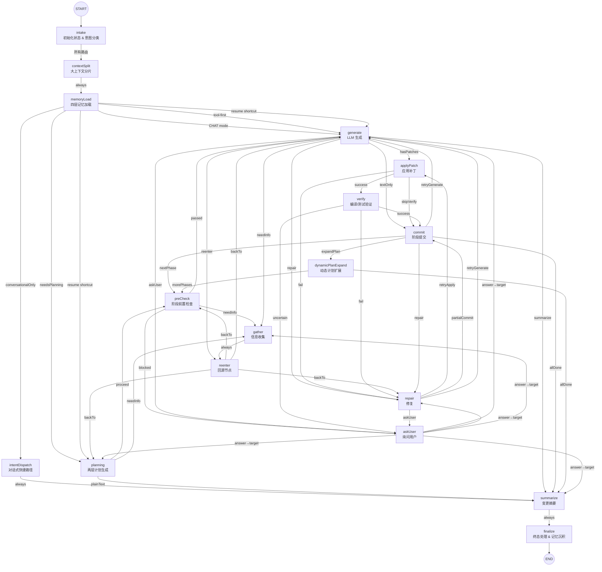

### 2.2 核心阶段循环（Phase Loop）

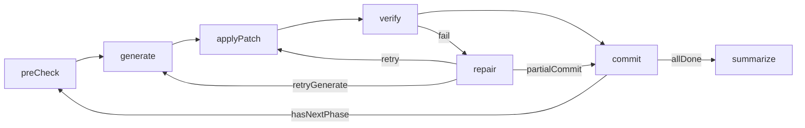

**Phase Loop 是默认图的核心执行模式**：每个 Phase 经历 `preCheck → generate → applyPatch → verify → commit` 完整循环，commit 后判断是否有下一阶段：
- 有 → 回到 preCheck 继续下一 Phase
- 无 → 进入 summarize → finalize 结束

---

## 3. Deep Research 图（研究模式）

### 3.1 节点拓扑

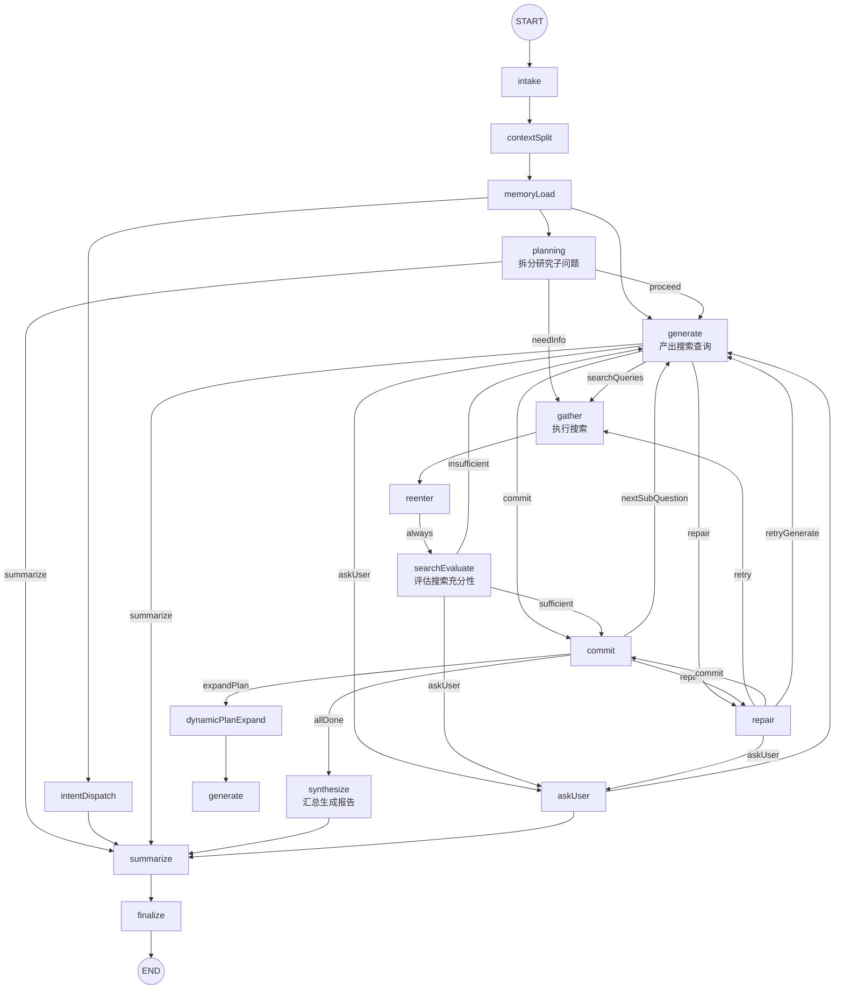

### 3.2 与默认图的关键差异

| 维度 | 默认图 | Deep Research 图 |
|------|--------|-----------------|
| 核心循环 | preCheck→generate→applyPatch→verify→commit | generate→gather→searchEvaluate→commit |
| 验证机制 | applyPatch + verify（编译/测试） | searchEvaluate（搜索充分性评估） |
| 终态路径 | commit→summarize | commit→synthesize→summarize |
| reenter 目标 | 回到发起节点 | 固定到 searchEvaluate |
| 产出 | 代码补丁 | 研究报告 |

---

## 4. 图的运行机制

### 4.1 请求入口与调度

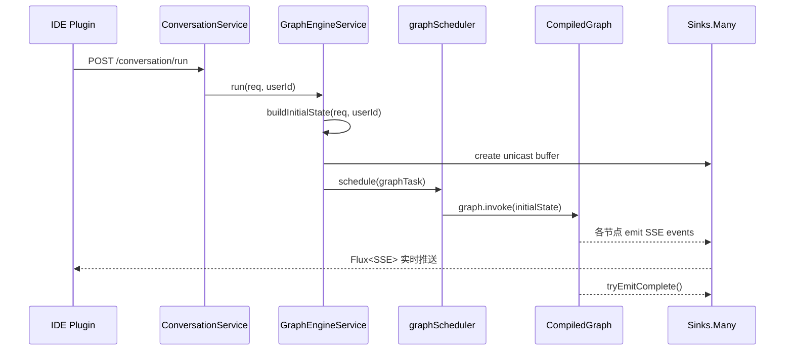

### 4.2 状态管理机制

**OverAllState** 是图的全局共享状态，所有节点通过 `apply(OverAllState state)` 读取和更新状态：

- **KeyStrategy**: 所有 key 注册 `ReplaceStrategy`（新值覆盖旧值）
- **STATE_KEYS**: 共 ~150+ 个状态键，覆盖会话、计划、生成、补丁、验证、修复、记忆等全部维度
- **SESSION_PERSISTENT_KEYS**: 跨图运行保留的键（sessionExecutionFacts, summaryForNextTurn 等）
- **STALE_EXECUTION_KEYS**: 每次新运行清除的键（gatheredInfo, phases, completedToolCalls 等）

### 4.3 条件路由机制

每个节点通过 `addConditionalEdges` 定义条件边，路由函数返回目标节点名称：

```
节点 → routeAfterXxx(state) → 返回下一节点名 → 图引擎跳转
```

关键路由函数：

| 节点 | 路由函数 | 决策依据 |
|------|---------|---------|
| intake | `routeAfterIntake` | resumeNextNode / mode / dispatchPath / needsTools |
| contextSplit | `routeAfterContextSplit` | always → memoryLoad |
| memoryLoad | `routeAfterMemoryLoad` | resumeNextNode / conversationalOnly / mode |
| planning | `routeAfterPlanning` | infoRequests / proceed / plainText |
| preCheck | `routeAfterPreCheck` | passed / needInfo / blocked |
| generate | `routeAfterGenerate` | patches / infoRequests / askUser / textOnly |
| applyPatch | `routeAfterApplyPatch` | success / fail / skipVerify |
| verify | `routeAfterVerify` | success / fail / uncertain |
| commit | `routeAfterCommit` | hasNextPhase / allDone / retryGenerate / repair |

### 4.4 SSE 实时事件推送

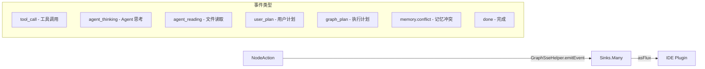

### 4.5 停止信号

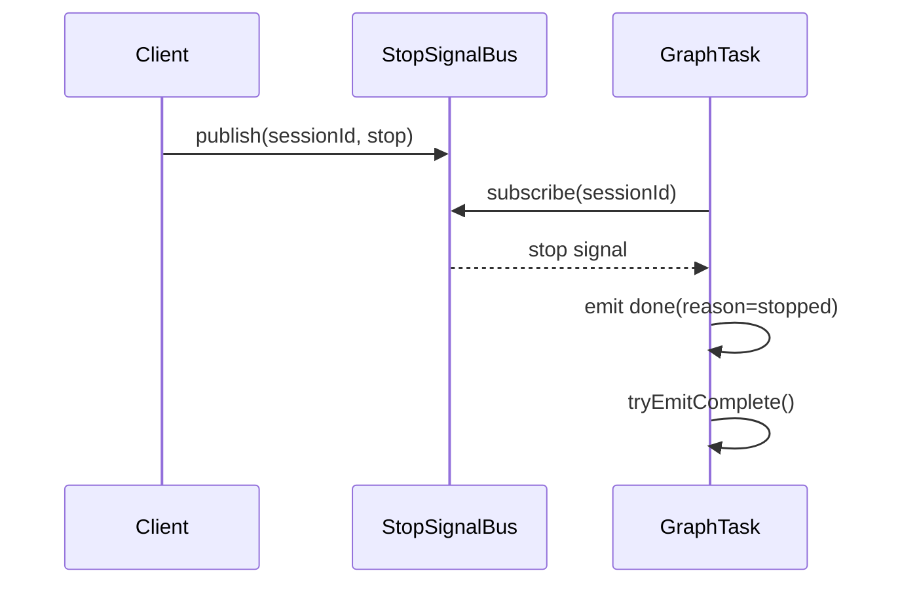

---

## 5. 历史对话加载

### 5.1 对话历史来源

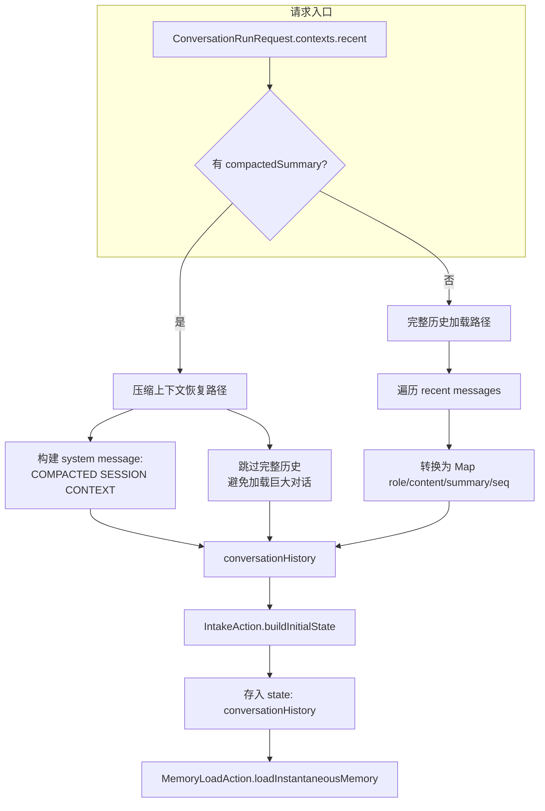

### 5.2 压缩上下文恢复

当之前的会话产生了 `compactedSummary`（通过 `CommitAction.compactActiveMemories` 触发），sessionDigest 会携带 `__COMPACTED__` 标记。恢复时：

1. 检测 compactedSummary 存在
2. 构建单条 system message：`[COMPACTED SESSION CONTEXT — restored from compressed summary]` + compactedSummary
3. 跳过完整对话历史的加载
4. 适用于超复杂任务（数百个 Phase）的场景

### 5.3 状态清理策略

| Intent 类型 | 清理行为 |
|------------|---------|
| `NEW` | 清除所有 STALE_EXECUTION_KEYS（gatheredInfo, phases, completedToolCalls 等） |
| `CONTINUE` | 清除 phase 级别状态但保留 session 执行事实 |
| `ANSWER` | 清除 askUser 恢复升级状态 + 卡死计数器 |

---

## 6. 记忆体系（四层记忆架构）

### 6.1 四层记忆模型

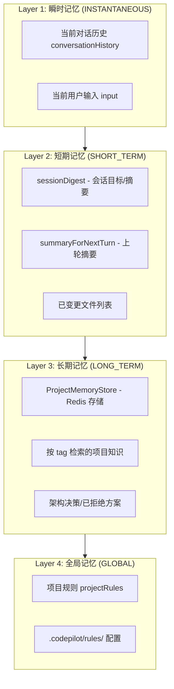

### 6.2 MemoryLoadAction 加载流程

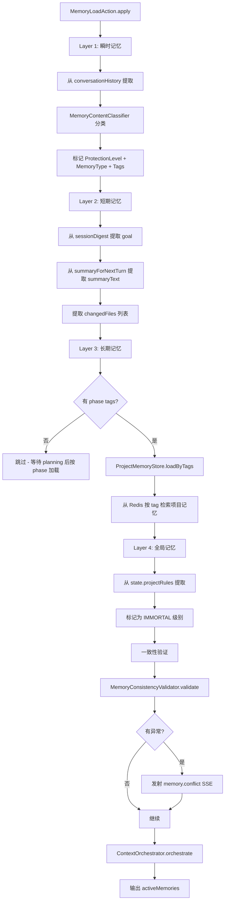

### 6.3 记忆属性分类

**ProtectionLevel（保护级别）**：

| 级别 | 含义 | 调度策略 |
|------|------|---------|
| IMMORTAL | 永不丢弃 | Hot（始终加载） |
| PROTECTED | 优先保留 | Warm（选择性加载） |
| DEGRADABLE | 可降级 | Cold（按需加载/压缩） |
| VOLATILE | 可丢弃 | Cold（预算不足时丢弃） |

**MemoryType（内容类型）**：

| 类型 | 示例 |
|------|------|
| FACT | 代码片段、文件内容 |
| DECISION | 架构决策、方案选择 |
| PROCEDURE | 操作步骤、执行流程 |
| PREFERENCE | 用户偏好、风格约定 |

### 6.4 记忆保存（沉积）机制

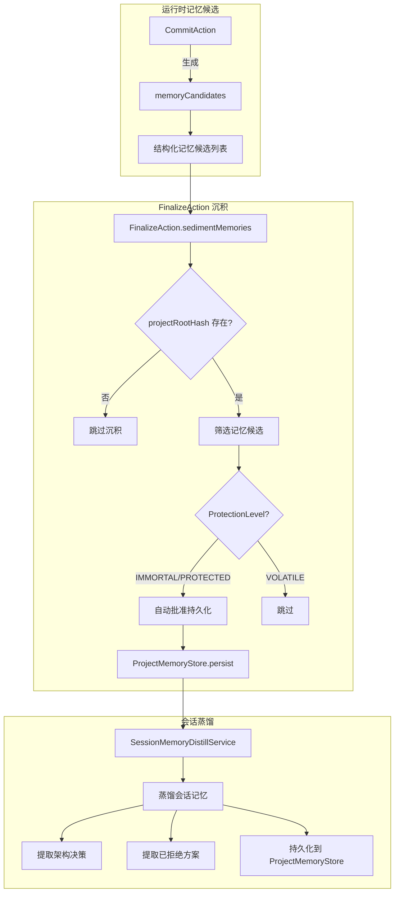

### 6.5 Phase 感知记忆加载

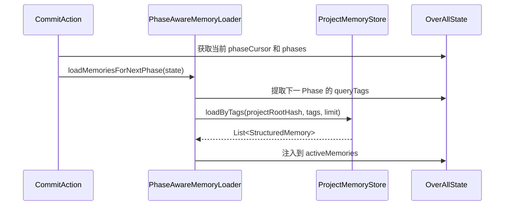

**核心设计**：长期记忆不是一次性全量加载，而是按 Phase 的 tag 精准检索。Planning 阶段为每个 Phase 声明 tag，后续各阶段按 tag 按需加载。

---

## 7. 上下文工程（Context Engineering）

### 7.1 ContextOrchestrator 编排策略

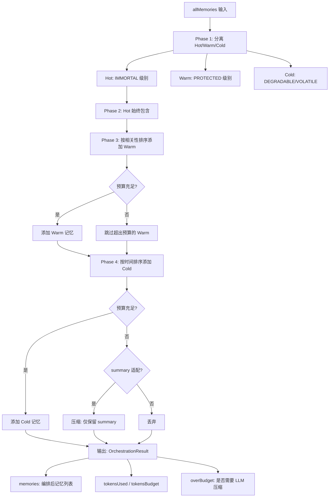

### 7.2 上下文预算与 Token 管理

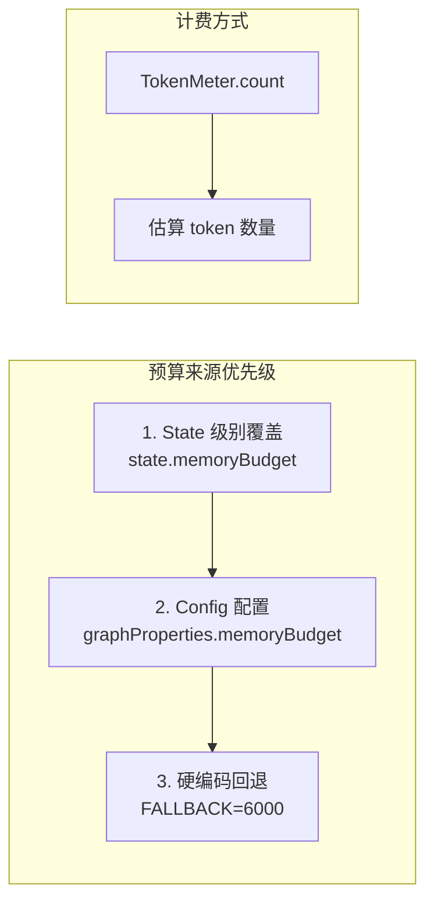

### 7.3 Prompt 注入方式

```mermaid
graph TB
    subgraph 记忆 → Prompt 映射
        M1[INSTANTANEOUS] -->|直接注入| P1[conversationHistory 消息列表]
        M2[SHORT_TERM] -->|渲染为| P2[SYSTEM PROMPT: SESSION CONTEXT 段]
        M3[LONG_TERM] -->|渲染为| P3[SYSTEM PROMPT: PROJECT MEMORY 段]
        M4[GLOBAL] -->|渲染为| P4[SYSTEM PROMPT: 规则段<br/>始终挂载, 体积受控]
    end
```

### 7.4 ContextSplit 上下文分片

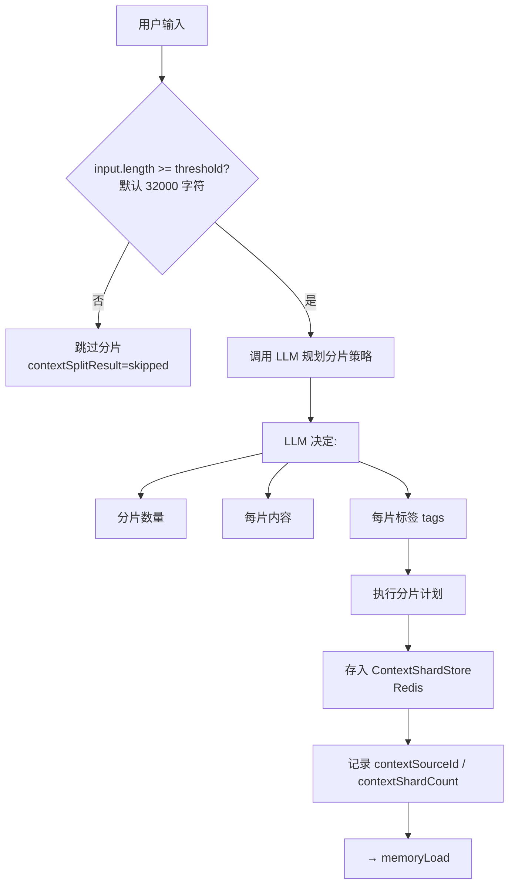

**设计原则**：LLM 决定分片策略，工程代码只执行 LLM 的计划。不假设输入是设计文档、代码分析还是 API 规范。

### 7.5 记忆压缩（LLM-assisted Compaction）

当 `ContextOrchestrator` 检测到 `overBudget=true` 时，触发 LLM 辅助压缩：

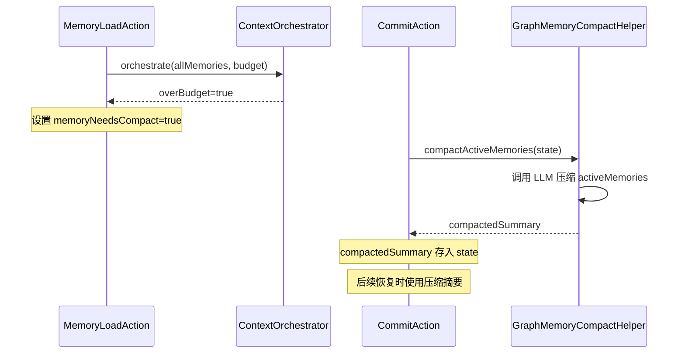

---

## 8. Prompt 工程

### 8.1 PromptRegistry 模板体系

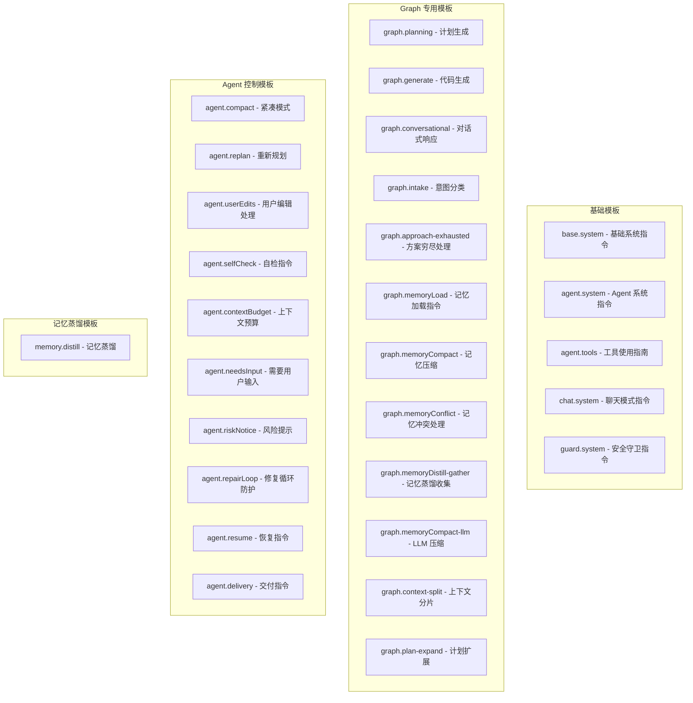

### 8.2 Prompt 组装流程（以 Planning 为例）

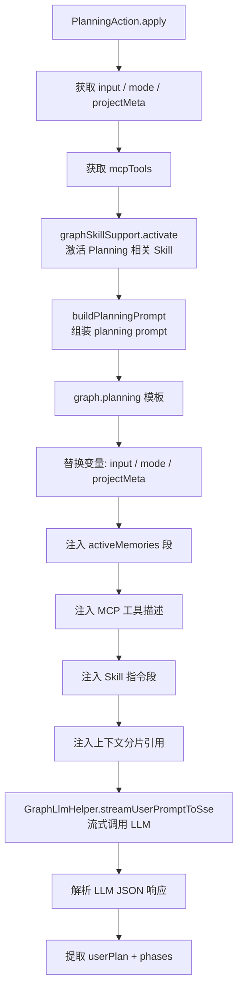

### 8.3 Prompt 注入的上下文段

每个 LLM 调用的 Prompt 包含以下段（按优先级排列）：

```
┌─────────────────────────────────────────────┐
│ 1. System Prompt                             │
│   ├── base.system / agent.system             │
│   ├── [SESSION CONTEXT] (SHORT_TERM 记忆)     │
│   ├── [PROJECT MEMORY] (LONG_TERM 记忆)      │
│   ├── projectRules (GLOBAL 记忆)              │
│   ├── memoryAnomalies (冲突提示)              │
│   └── Skill 激活段                            │
├─────────────────────────────────────────────┤
│ 2. Conversation History                       │
│   ├── 完整对话消息列表                         │
│   └── 或 COMPACTED SESSION CONTEXT            │
├─────────────────────────────────────────────┤
│ 3. Task Context                              │
│   ├── 当前 Phase 信息                         │
│   ├── gatheredInfo (已收集信息)               │
│   ├── completedToolCalls (已执行工具)         │
│   ├── MCP 工具 schema                        │
│   └── 上下文分片内容                          │
├─────────────────────────────────────────────┤
│ 4. User Prompt                               │
│   └── graph.xxx 模板 + 变量替换               │
└─────────────────────────────────────────────┘
```

---

## 9. RAG（检索增强生成）应用

### 9.1 RAG 搜索架构

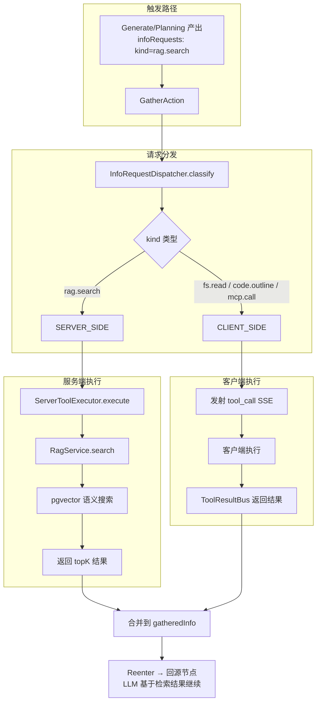

### 9.2 RAG 检索流程

```mermaid
sequenceDiagram
    participant Gen as GenerateAction
    participant Gather as GatherAction
    participant IRD as InfoRequestDispatcher
    participant STE as ServerToolExecutor
    participant RAG as RagService
    participant PG as pgvector

    Gen->>Gather: infoRequests=[{kind: rag.search, args: {query, topK}}]
    Gather->>IRD: classify(requests)
    IRD-->>Gather: serverSide=[rag.search request]
    Gather->>STE: executeServerSide(serverRequests)
    STE->>RAG: executeRagSearch(args, sessionId)
    RAG->>PG: SELECT ... ORDER BY embedding <=> query_vector LIMIT topK
    PG-->>RAG: 匹配文档片段
    RAG-->>STE: RagSearchResponse
    STE-->>Gather: {id, kind, ok, result}
    Gather->>Gather: 合并到 gatheredInfo
```

### 9.3 InfoRequest 类型分类

| kind | 执行端 | 说明 |
|------|--------|------|
| `rag.search` | 服务端 | pgvector 语义搜索 |
| `http.fetch` | 服务端 | HTTP 请求 |
| `fs.read` | 客户端 | 文件读取 |
| `fs.list` | 客户端 | 目录列表 |
| `fs.grep` | 客户端 | 文件搜索 |
| `code.outline` | 客户端 | 代码大纲 |
| `code.symbol` | 客户端 | 符号查找 |
| `code.usages` | 客户端 | 用法查找 |
| `shell.exec` | 客户端 | Shell 命令 |
| `mcp.call` | 客户端 | MCP 工具调用 |

---

## 10. CoT（Chain of Thought）应用

### 10.1 Intake 意图分类中的 CoT

`IntakeIntentClassifier` 使用 LLM 推理用户意图，返回结构化的推理结果：

```mermaid
flowchart LR
    A[graph.intake prompt] --> B[LLM 推理]
    B --> C[输出: IntakeIntent]
    C --> C1[needsTools: 是否需要工具]
    C --> C2[needsPlanning: 是否需要规划]
    C --> C3[tools: 推荐工具列表]
    C --> C4[dispatchPath: CONVERSATIONAL/SIMPLE/GRAPH]
    C --> C5[reason: 推理过程]
```

### 10.2 Planning 中的两层计划（CoT 结构化）

Planning 节点产出两层计划，本质上是一种结构化的 CoT：

```mermaid
graph TB
    subgraph Layer1["用户计划 (User Plan) - 稳定、用户可见"]
        U1[Step 1: 分析项目结构]
        U2[Step 2: 实现核心功能]
        U3[Step 3: 编写测试]
    end
    
    subgraph Layer2["执行阶段 (Execution Phases) - 动态、图内部"]
        P1["Phase p1: 读取 pom.xml 和项目结构<br/>entry: [fs.read pom.xml]<br/>exit: [文件存在]"]
        P2["Phase p2: 实现 UserService<br/>entry: [fs.read UserService.java]<br/>exit: [编译通过]"]
        P3["Phase p3: 编写单元测试<br/>entry: [fs.read test/]<br/>exit: [测试通过]"]
    end
    
    U1 --> P1
    U2 --> P2
    U3 --> P3
```

**LLM 被要求返回 JSON 包含 `userPlan` 和 `phases[]`**，这迫使模型在生成代码前先思考步骤。

### 10.3 PreCheck 前置检查（CoT 约束）

PreCheck 节点在每个 Phase 执行前验证条件，强制 LLM 遵循"先检查再行动"的思维链：
- 检查依赖文件是否存在
- 检查所需工具是否可用
- 检查前置 Phase 是否完成
- 检查是否存在冲突修改

### 10.4 Generate 中的 CoT

Generate 节点的 Prompt 要求 LLM 返回结构化 JSON：
```json
{
  "thinking": "分析当前阶段需要的变更...",
  "patches": [...],
  "infoRequests": [...],
  "askUser": {...}
}
```

`thinking` 字段是显式的思维链输出，通过 `agent_thinking` SSE 推送给客户端显示。

---

## 11. ReAct（Reasoning + Acting）应用

### 11.1 Gather-Reenter 循环（ReAct 核心模式）

```mermaid
sequenceDiagram
    participant Node as 源节点(Planning/Generate/Repair)
    participant Gather as GatherAction
    participant Reenter as ReenterAction
    participant IRD as InfoRequestDispatcher
    participant Client as IDE Plugin

    Note over Node: Reasoning: 需要更多信息
    Node->>Node: 产出 infoRequests
    Node-->|route: gather| Gather
    
    Note over Gather: Acting: 执行信息收集
    Gather->>IRD: classify(infoRequests)
    IRD-->>Gather: serverSide + clientSide
    
    par 服务端请求
        Gather->>IRD: executeServerSide
        IRD-->>Gather: RAG/HTTP 结果
    and 客户端请求
        Gather->>Client: tool_call SSE
        Client-->>Gather: ToolResultBus 结果
    end
    
    Gather->>Gather: 合并到 gatheredInfo
    Gather-->|route: reenter| Reenter
    
    Note over Reenter: Reasoning: 带新信息重新推理
    Reenter-->|route: backTo source| Node
    
    Note over Node: 基于新信息继续推理/生成
```

### 11.2 Generate-ApplyPatch-Verify-Repair 循环

这是另一个 ReAct 模式的体现：

```mermaid
graph LR
    G[Generate<br/>Reasoning: 推断代码变更] --> AP[ApplyPatch<br/>Acting: 应用补丁]
    AP --> V[Verify<br/>Observation: 验证结果]
    V -->|success| C[Commit]
    V -->|fail| R[Repair<br/>Reasoning: 分析失败原因]
    R -->|retry| AP
    R -->|retryGenerate| G
```

**ReAct 模式在图中的体现**：

| ReAct 步骤 | 图中的节点 | 说明 |
|------------|-----------|------|
| **Reasoning** | Generate / Planning / Repair | LLM 推理下一步行动 |
| **Acting** | ApplyPatch / Gather / Commit | 执行具体操作 |
| **Observation** | Verify / PreCheck / searchEvaluate | 观察执行结果 |
| **Reflection** | Repair / Reenter | 基于观察反思并调整策略 |

### 11.3 AskUser 中断-恢复（人机协作 ReAct）

```mermaid
sequenceDiagram
    participant Node as 源节点(Generate/Verify)
    participant AskUser as AskUserAction
    participant CPS as GraphCheckpointStore
    participant Redis as Redis
    participant Client as IDE Plugin
    participant Resume as GraphEngineService.resume

    Node-->|route: askUser| AskUser
    AskUser->>AskUser: 构建结构化问题<br/>(single-choice/multi-choice/yes-no/freeform)
    AskUser->>CPS: 保存 Checkpoint(state, nextNode)
    CPS->>Redis: persist(snapshot)
    AskUser->>Client: needs_input SSE
    AskUser->>AskUser: throw GraphInterruptException
    
    Note over Client: 用户思考并回答...
    
    Client->>Resume: POST /conversation/run<br/>(intent=ANSWER, answers)
    Resume->>Redis: load(continuationToken)
    Redis-->>Resume: CheckpointSnapshot
    Resume->>Resume: IntakeAction.restoreFromCheckpoint
    Resume->>Resume: graph.invoke(restoredState)
    
    Note over Resume: 从中断点继续执行
```

**Checkpoint 保存内容**：
- 完整 state 数据
- nextNode（恢复后的起始节点）
- askUserPhaseCursor（恢复后的 Phase 位置）

---

## 12. 完整请求生命周期

### 12.1 一次完整的 AGENT 模式请求

```mermaid
sequenceDiagram
    participant C as Client
    participant GE as GraphEngineService
    participant I as IntakeAction
    participant CS as ContextSplitAction
    participant ML as MemoryLoadAction
    participant P as PlanningAction
    participant PC as PreCheckAction
    participant G as GenerateAction
    participant AP as ApplyPatchAction
    participant V as VerifyAction
    participant CM as CommitAction
    participant S as SummarizeAction
    participant F as FinalizeAction

    C->>GE: run(req, userId)
    GE->>GE: buildInitialState
    GE->>GE: graph.invoke(initialState)
    
    Note over GE: intake
    I->>I: 意图分类(IntakeIntentClassifier)
    I->>I: routeAfterIntake → planning
    
    Note over GE: contextSplit
    CS->>CS: 检查输入大小, 可能 LLM 分片
    
    Note over GE: memoryLoad
    ML->>ML: 加载四层记忆
    ML->>ML: ContextOrchestrator 编排
    ML->>ML: routeAfterMemoryLoad → planning
    
    Note over GE: planning
    P->>P: LLM 流式生成计划
    P->>C: SSE: user_plan + graph_plan
    
    Note over GE: Phase Loop (Phase 1..N)
    loop 每个 Phase
        PC->>PC: 前置条件检查
        G->>G: LLM 生成代码/工具调用
        G->>C: SSE: agent_thinking + tool_call
        C-->>G: tool_result
        AP->>AP: 应用补丁到文件
        V->>C: SSE: tool_call(ide.diagnostics)
        C-->>V: 诊断结果
        CM->>CM: 标记 Phase 完成, 推进下一 Phase
    end
    
    Note over GE: 终态
    S->>S: 生成分层摘要(PRIMARY/SECONDARY/AUXILIARY)
    F->>F: 记忆沉积 + sessionDigest + done SSE
    F->>C: SSE: done(reason=final)
```

### 12.2 Interrupt-Resume 生命周期

```mermaid
stateDiagram-v2
    [*] --> Running: run()
    Running --> AskUser: 需要用户输入
    AskUser --> Checkpointed: 保存 Checkpoint 到 Redis
    Checkpointed --> AwaitingInput: 发射 needs_input SSE
    AwaitingInput --> Resumed: resume(token, answers)
    Resumed --> Running: 从中断点继续
    
    Running --> Completed: 正常结束
    Running --> Stopped: 用户停止
    Running --> Failed: 执行异常
    
    Completed --> [*]
    Stopped --> [*]
    Failed --> [*]
```

---

## 13. 关键设计决策总结

### 13.1 为什么 intake 后必须经过 contextSplit 和 memoryLoad？

所有从 intake 出发的条件路由都映射到 `contextSplit`（而非直接到目标节点），原因：
1. **contextSplit** 处理大上下文分片，确保后续节点不会收到超长输入
2. **memoryLoad** 统一加载四层记忆并编排，确保所有下游节点都有完整的上下文
3. 两个中间节点对路由是**透明的**——它们不改变路由决策，只丰富状态

### 13.2 为什么 resume 不直接跳到目标节点？

Resume 时仍然经过 `intake → contextSplit → memoryLoad`，因为：
1. **intake** 需要注入运行时配置（maxPhaseFailureAttempts 等）
2. **memoryLoad** 需要重新加载记忆（Checkpoint 中不包含最新记忆）
3. 通过 `resumeNextNode` 键实现"快速通道"——memoryLoad 后直接路由到目标节点

### 13.3 记忆沉积为什么在 Finalize 而不是 Commit？

1. Commit 时可能有更多 Phase 待执行，记忆还在动态变化
2. Finalize 是终态节点，此时所有变更已确定，可以安全地蒸馏和沉积
3. 避免在中间 Phase 沉积不完整或不一致的记忆

### 13.4 防止无限循环的设计

| 循环类型 | 防护机制 |
|---------|---------|
| commit→repair→commit | partialCommit 状态清除 + verify 成功时忽略 toolFailures |
| generate→gather→generate | gatherLoopCount 计数 + gatherExhausted 标记 |
| repair→generate→repair | toolApproachHistory 追踪 + approachExhausted 标记 |
| 任意节点循环 | maxPhaseFailureAttempts 上限 + PhaseFailureRepairHelper 放弃判定 |

---

## 14. 总结

CodePilot Graph Engine 是一个精心设计的有向图编排引擎，其核心特征包括：

1. **声明式图定义**：通过 StateGraph API 定义节点和条件边，编译后按请求驱动
2. **四层记忆架构**：瞬时/短期/长期/全局，配合 ContextOrchestrator 实现预算感知的上下文管理
3. **Phase Loop 核心循环**：preCheck→generate→applyPatch→verify→commit 的迭代式执行
4. **ReAct 模式**：Gather-Reenter 循环和 Generate-Apply-Verify-Repair 循环体现推理-行动-观察的迭代
5. **CoT 结构化**：Planning 的两层计划、Generate 的 thinking 字段、PreCheck 的条件验证
6. **RAG 增强**：通过 infoRequests 机制触发 rag.search，由 ServerToolExecutor 在服务端执行 pgvector 搜索
7. **中断-恢复机制**：AskUser 通过 Checkpoint + GraphInterruptException 实现人机协作
8. **Prompt 模板化**：PromptRegistry 管理 28+ 个模板段，按节点动态组装
9. **上下文工程**：ContextSplit 分片 + ContextOrchestrator 编排 + 记忆压缩 + 压缩恢复