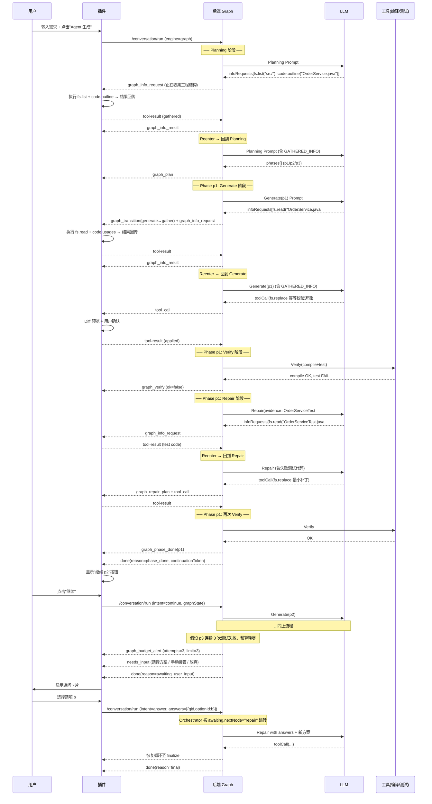

# 06 — Graph 编排方案（分步生成 · 自动检测 · 失败修复 · 人工介入）

> 本文件是对 `01-架构设计.md` §4.2 Agent 模式与 `03-后端设计.md` §6 Agent 循环的**演进增强**，并与 `05-接口文档.md` 的 `/v1/conversation/*` 完全兼容（新增字段，不破坏旧字段）。
>
> 背景：现有方案虽然 Agent 模式内部是 `Plan → ToolCall → ToolResult → SelfCheck` 的多轮循环，但本质是"单次 run 内由 Prompt 驱动的隐式状态机"。在代码生成场景下，一旦模型**一次性吐出大段 Patch 却存在语法/编译/测试问题**，修复是被动的、强依赖 `selfCheck` 的主观判断，稳定性不够。
>
> 本方案引入**显式的 Graph 编排器（Graph Orchestrator）**，把"生成 → 检测 → 修复 → 下一阶段 → 等待用户"建模为**有限状态图**，由后端作为确定性调度器驱动 LLM 与工具协作，从而让失败修复、阶段推进、用户介入**可观察、可回放、可中断、可恢复**。

---

## 1. 为什么需要 Graph 能力

| 现状痛点 | Graph 带来的改变 |
|---|---|
| Plan 一次性产出，Replan 靠模型主观判断 | 规划阶段 → 阶段列表（`phases[]`），每个阶段自带**准入 / 完成 / 失败** 三套断言 |
| 生成与校验在同一次 LLM 回复里，失败后只能原地重试 | 每个阶段后**强制跳转到 Verify 节点**，节点结果决定 `Success → 下一阶段`、`Fail → Repair 节点`、`Uncertain → AskUser 节点` |
| 修复次数无硬性上限，容易陷入"越改越错" | Graph 节点持有 `attempts / budgetTokens / timeBudgetMs`，超限自动升格为 `needs_input` |
| 断点恢复依赖 `lastPlan + completedToolCalls`，但阶段语义模糊 | 断点记录"当前节点 ID + 阶段状态"，恢复时精确回到上次节点 |
| 等待用户输入后，如何无缝续跑靠插件端自行拼装 | `AwaitUserInput` 是一类一等公民的节点，`continuationToken` 绑定到节点实例 |
| LLM 需要读额外代码/跑命令获取信息，但和写操作混在一起 | **Gather/Reenter** 节点把只读信息收集与写操作解耦 |
| 日志难以画出"到底卡在哪一步" | Graph 每条边都发 SSE `graph_transition` 事件，前端可绘制节点高亮 |

> 核心一句话：**把隐式 Prompt 状态机变为显式后端状态机**，让 Prompt 只负责"某个节点内部的小任务"，阶段切换交给代码。

---

## 2. 节点与边（标准节点集）

> 除"生成→校验→修复"主干外，显式引入 **Gather（信息收集）** 与 **Reenter（信息回灌恢复）** 两类节点，覆盖"LLM 主动请求读文件/查符号/跑命令/检索 RAG/问 MCP"等**一切"拿到新信息再继续"**的场景；`Planning / PreCheck / Generate / Repair` 四个节点都允许跳转到 `Gather`，形成"需要信息 → 去拿 → 回来继续"的闭环。

### 2.1 主流程图（完整版）

```
                       ┌────────────┐
                       │   Intake   │  入口：解析 input/intent/answers，加载 graphState
                       └─────┬──────┘
                             ▼
                       ┌────────────┐          need-info
                       │  Planning  │ ─────────────────────┐
                       └─────┬──────┘                       │
                             ▼                               │
               ┌────────────────────────────┐               │
               │  PhaseLoop (foreach phase) │               │
               └─────────────┬──────────────┘               │
                             ▼                               │
                       ┌────────────┐  env-missing           │
                       │  PreCheck  │───────────────────────┤
                       └─────┬──────┘                        │
                       ok    │                               │
                             ▼                               ▼
                       ┌────────────┐ need-info    ┌─────────────────┐
                       │  Generate  │─────────────▶│     Gather      │ (只读信息收集)
                       └─────┬──────┘              │  fs.read /      │
                             │                      │  code.outline / │
                             │                      │  code.symbol /  │
                             │                      │  code.usages /  │
                             │                      │  fs.grep /      │
                             │                      │  shell.exec(只读)│
                             │                      │  rag.search /   │
                             │                      │  mcp.call(只读) │
                             │                      │  http.fetch     │
                             ▼                      └────────┬────────┘
                       ┌────────────┐                        │ ExecuteTool
                       │ ApplyPatch │ (写操作：Diff 预览)      │ (客户端 or 后端)
                       └─────┬──────┘                        ▼
                             ▼                      ┌────────────────┐
                       ┌────────────┐                │    Reenter     │ 把结果写入 state.gathered[]
                       │   Verify   │                │ (回灌节点)     │ 按 resumeTo 跳回原节点
                       └─────┬──────┘                └───────┬────────┘
         ┌───────────────────┼────────────────┐              │ back to
      success              fail            uncertain         │ Planning | PreCheck
         ▼                   ▼                 ▼             │ Generate | Repair
    ┌────────┐         ┌──────────┐  need-info┌──────────┐   │
    │ Commit │         │  Repair  │──────────▶│  Gather  │───┘
    └───┬────┘         └────┬─────┘           └──────────┘
        │                    │ retry    attempts<N
        │                    └──────────────┐
        │                             attempts≥N
        │                                   ▼
        │                             ┌──────────┐
        │                             │ AskUser  │ 升格为人工介入：发 needs_input
        │                             └────┬─────┘
        ▼                                  ▼
 有下一阶段 ─▶ PhaseLoop             ┌──────────────────┐
 无下一阶段                           │  AwaitUserInput   │ 本次 run 结束
        ▼                             └────────┬─────────┘ done.reason=awaiting_user_input
   ┌────────┐                                  │
   │Finalize│                                  │  下次 /conversation/run intent=answer
   └────────┘                                  ▼
                                    (Orchestrator 载入 graphState →
                                     跳到 awaiting.nextNode 续跑)

 备注：PreCheck 的 env-missing 与 Planning/Generate/Repair 的 need-info 都汇入同一个 Gather 节点；
       Gather 完成后由 Reenter 按 gatherReq.resumeTo 精确跳回原节点，attempts 不递增、阶段状态不变。
```

### 2.2 节点定义（`graph.node.kind`）

| kind | 语义 | 入参 | 出参 | 常见失败 | 可发起 Gather |
|---|---|---|---|---|---|
| `intake` | 请求预处理、归一化 answers、挂载 graphState | `request` | `state0` | 协议错误 | 否 |
| `planning` | LLM 产出 `phases[]` 与 `verify[]` | `state` | `plan` 或 `infoRequests[]` | Schema 不合规 | **是** |
| `preCheck` | 校验"阶段进入条件"（依赖文件、端口、工具可用等） | `phase` | `ok` / `fail` / `infoRequests[]` | 依赖缺失 | **是** |
| `generate` | LLM 基于阶段目标产出 Patch/ToolCall | `phase, context` | `toolCalls[]` 或 `infoRequests[]` | 空输出 / 越界 | **是** |
| `applyPatch` | 客户端执行 fs/shell/mcp 的**写**操作 | `toolCall` | `ToolResult` | 写入冲突、命令失败 | 否 |
| `verify` | 跑阶段退出断言（编译/测试/lint） | `phase, applied` | `VerifyReport` | compile / test fail | 否 |
| `repair` | 基于 `VerifyReport` 产出**最小修复补丁** | `failure` | `toolCalls[]` 或 `infoRequests[]` | 越修越多 | **是** |
| `commit` | 标记阶段完成，写 checkpoint | `phase` | `done` | — | 否 |
| **`gather`** | **只读信息收集**：批量执行 `infoRequests[]`，汇总为 `gatheredInfo` | `infoRequests[]` | `gatheredInfo` | 超时/权限/体积超限 | 否 |
| **`reenter`** | **回灌节点**：把 `gatheredInfo` 合并进 `state.gathered[]`，按 `resumeTo` 跳回原节点（attempts 不递增） | `gatheredInfo, resumeTo` | `state'` | resumeTo 非法 | 否 |
| `askUser` | 发送 `needs_input`，产出 `awaiting` | `question` | `awaiting` | — | 否 |
| `awaitUserInput` | 终止本次 run，产出 `continuationToken` | `state` | `token` | — | 否 |
| `finalize` | 汇总并返回 `final` | `state` | `answer` | — | 否 |
| `abort` | 任一节点显式终止 | `reason` | — | — | 否 |

### 2.3 边的判定函数（后端代码实现，不交给 LLM）

```java
sealed interface EdgeDecision {
    record Go(String nextNode) implements EdgeDecision {}
    record Retry(int attempt) implements EdgeDecision {}
    record Gather(List<InfoRequest> reqs, String resumeTo) implements EdgeDecision {}
    record AskUser(NeedsInput q) implements EdgeDecision {}
    record Await(String token) implements EdgeDecision {}
    record Done(String reason) implements EdgeDecision {}
}
```

> **关键设计**：`Gather` 是**声明式**的信息请求——LLM 在 `Planning / PreCheck / Generate / Repair` 任一节点里输出 `infoRequests[]`，由 Graph 调度器决定执行顺序、合并同类请求、去重、做体积与权限校验，再把结果在下一次 LLM 调用前注入回 system/user 上下文。这避免了 LLM 在 `Generate` 中"边改代码边读文件"导致的上下文膨胀与工具越界。

### 2.4 `Planning / PreCheck / Generate / Repair` 输出契约扩展

四个节点的 LLM 回复 JSON 新增 `infoRequests[]`，三字段互斥（每轮最多出现一种）：

```jsonc
{
  "thought": "本阶段需要先查清 OrderService 的事务边界",
  "infoRequests": [                          // 互斥字段 1：声明要收集的只读信息
    {
      "id": "ir-1",
      "kind": "fs.read",
      "args": {"path":"src/.../OrderService.java","range":[1,200]},
      "why": "理解 createOrder 的入参/返回/异常"
    },
    {
      "id": "ir-2",
      "kind": "code.symbol",
      "args": {"symbol":"OrderRepository.findByKey","scope":"project"},
      "why": "判断是否已有幂等键查询方法"
    },
    {
      "id": "ir-3",
      "kind": "shell.exec",
      "args": {"cmd":"git log -n 5 --oneline -- src/.../OrderService.java","readOnly":true,"timeoutMs":5000},
      "why": "了解最近修改历史"
    }
  ],
  "toolCalls": null,                         // 互斥字段 2：写/执行工具（Generate/Repair 专属）
  "final":     null                          // 互斥字段 3：仅 Finalize 阶段
}
```

### 2.5 信息请求种类（`InfoRequest.kind`）

| kind | 执行方 | 说明 | 读写属性 |
|---|---|---|---|
| `fs.read` | 插件端 | 读取文件指定 range，返回 `{content, sha1, totalLines}`；支持一次多 range | 只读 |
| `fs.list` | 插件端 | 目录清单（受 workspace 边界约束） | 只读 |
| `fs.grep` | 插件端 | 正则全文检索（ripgrep 封装），返回 hits[] + 片段 | 只读 |
| `code.outline` | 插件端（PSI） | 返回文件/包的类/方法大纲（签名+行号） | 只读 |
| `code.symbol` | 插件端（PSI） | 按符号名定位定义/声明 | 只读 |
| `code.usages` | 插件端（PSI） | 查找某方法/字段的引用点 | 只读 |
| `shell.exec` | 插件端 | **只读命令**（必须 `readOnly:true`）：`git log / git diff / git status / ls / cat / grep / find / which / --version / node -v / mvn -v` 等白名单 | 仅只读 |
| `rag.search` | 后端 | 项目临时向量检索（`03-后端设计.md` §8 RAG） | 只读 |
| `mcp.call` | 后端/插件 | 调用 MCP Server 的**只读**方法（manifest 标注 `readOnly:true`） | 仅只读 |
| `http.fetch` | 后端 | 允许列表内的公网文档抓取，受沙箱 + 超时 + 大小限制 | 只读 |

> **安全红线**：`Gather` 节点**禁止**任何写操作。若 LLM 把写意图误放到 `infoRequests`，Orchestrator 直接拒绝该条并审计 `gather_write_blocked`，不计入 attempts。

### 2.6 `InfoRequest` 完整 Schema

```jsonc
{
  "id": "ir-1",
  "kind": "fs.read",
  "args": { /* 按 kind 约束 */ },
  "why": "≤80 字，用于审计与 UI 展示",
  "priority": 1,                   // 可选：同批内执行顺序
  "maxBytes": 32000,               // 可选：结果体积上限，超限自动截断并摘要化
  "timeoutMs": 5000,               // 可选：单请求超时
  "cacheKey": "OrderService.java#1-200#sha1:..." // 可选：命中缓存直接回灌
}
```

---

## 3. Phase / VerifyReport 数据模型

### 3.1 Phase

```jsonc
{
  "id": "p1",
  "title": "实现订单幂等键校验",
  "intent": "code-change",           // code-change | config | migration | test | doc
  "depends": [],                     // 依赖的前置 phaseId
  "entry": [                         // 准入断言（PreCheck 节点执行）
    {"kind":"fileExists","path":"src/main/java/.../OrderService.java"},
    {"kind":"packageManagerReady","tool":"mvn"}
  ],
  "exit": [                          // 退出断言（Verify 节点执行）
    {"kind":"compile","tool":"mvn","args":["-q","-DskipTests","compile"]},
    {"kind":"test","tool":"mvn","args":["-q","-Dtest=OrderServiceTest","test"]},
    {"kind":"lint","tool":"checkstyle"},
    {"kind":"invariant","assert":"没有新增公共 API 破坏性改动"}
  ],
  "budget": {"attempts": 3, "maxTokens": 8000, "maxTimeMs": 180000},
  "risk": "medium",
  "notes": "若 Redis 不可用则在 AskUser 节点让用户二选一"
}
```

### 3.2 VerifyReport（Verify 节点产出）

```jsonc
{
  "phaseId": "p1",
  "ok": false,
  "severity": "error",               // error | warn | info
  "checks": [
    {"kind":"compile","ok":true,"durationMs":3200},
    {"kind":"test","ok":false,
     "failures":[
       {"test":"OrderServiceTest#shouldRejectDuplicate",
        "message":"expected 409 but was 200",
        "file":"OrderServiceTest.java","line":87}
     ]},
    {"kind":"lint","ok":true}
  ],
  "classification": "CODE",          // TOOL | CODE | ENV | SPEC
  "suggestedFix": "在 createOrder 入口前加入 idempotentKey 查询",
  "evidence": [
    {"path":"src/.../OrderService.java","range":[40,72],"sha1":"..."}
  ]
}
```

### 3.3 Graph 运行时状态（`GraphState`）

后端仅在 Redis 保存 24h（key=`graph:state:{sid}`），权威副本由插件端落 `plans/graph-{n}.json`：

```jsonc
{
  "sessionId":"sess-uuid",
  "graphId":"gph-<hash>",
  "currentNode":"verify",
  "phaseCursor":"p1",
  "phases":[ /* Phase[] */ ],
  "attempts": {"p1": 2},             // Gather/Reenter 不递增此值
  "history":[
    {"seq":1,"node":"intake","at":169...,"ok":true},
    {"seq":2,"node":"planning","at":169...,"ok":true},
    {"seq":3,"node":"generate","phaseId":"p1","at":169...,"ok":true,
     "emitted":{"infoRequests":["ir-1","ir-2"]}},
    {"seq":4,"node":"gather","phaseId":"p1","at":169...,"ok":true,
     "resumeTo":"generate","requestIds":["ir-1","ir-2"]},
    {"seq":5,"node":"reenter","phaseId":"p1","at":169...,"ok":true},
    {"seq":6,"node":"generate","phaseId":"p1","at":169...,"ok":true},
    {"seq":7,"node":"verify","phaseId":"p1","at":169...,"ok":false,
     "report":{"classification":"CODE"}}
  ],
  "completedToolCalls":[ /* 与 05-接口文档.md §3.5 相同 */ ],
  "gathered":[                       // 已收集的只读信息
    {
      "requestId":"ir-1",
      "kind":"fs.read",
      "result":{"sha1":"...", "totalLines":420, "truncated":false, "bytes":7820,
                "contentRef":"gathered/g-001.txt"},
      "collectedAt":169...,
      "ttlSec":3600
    }
  ],
  "lastPlanDigest":{...},
  "awaiting":null                    // 或见 §3.4
}
```

### 3.4 `awaiting` 结构（AwaitUserInput 节点产出）

```jsonc
{
  "node":"awaitUserInput",
  "reason":"budget_exceeded | needs_input | phase_done_manual",
  "questionSetId":"qs-1",
  "continuationToken":"ctk-xxx",
  "nextNode":"repair",                 // 用户回答后精确跳转目标
  "nextNodeArgs":{"phaseId":"p1","carriedVerifyReport":"<hash>"},
  "expectedAnswerKinds":["single-choice","freeform"]
}
```

> `nextNode` 由**发起 AskUser 的节点**写入，Orchestrator 按此直接跳转，无需回放。

---

## 4. Gather / Reenter 详细机制（信息获取的完整闭环）

### 4.1 触发条件

`Planning / PreCheck / Generate / Repair` 四个节点在以下情况会产出 `infoRequests[]` 而非继续前行：

- LLM 主动判断"当前信息不足以产出可靠 Patch"（Generate / Repair）；
- LLM 判断"需要先了解工程结构再拆阶段"（Planning）；
- `PreCheck` 断言需要"运行时探测"（例如 `packageManagerReady` 需执行 `mvn -v`）；
- `Repair` 拿到 `VerifyReport` 后需要读失败测试/相关调用方代码再给补丁。

### 4.2 调度器处理流程（Orchestrator 内部 9 步）

```
① 节点输出 infoRequests[] 并返回 EdgeDecision.Gather(reqs, resumeTo=<自己>)
② 校验（后端）:
     - kind 是否在白名单；args 是否合法；shell.exec 必须 readOnly:true
     - 单次 infoRequests.length ≤ 8
     - 合计 args.path 是否在 workspace 边界
     - 去重：同 cacheKey 命中 state.gathered[] → 直接复用，不下发执行
③ 发 SSE graph_info_request 让插件端展示"正在收集"
④ 分拣执行：
     - 插件执行类（fs/code/shell 只读）  → 通过 tool_call 下发，客户端批量执行
     - 后端执行类（rag/http/mcp 只读）   → 后端并发执行
⑤ 收集结果，统一经过 RedactFilter 脱敏
⑥ 体积控制：
     - 每条结果超 maxBytes → 生成 headN + tailN + summary 三段
     - 合计超 policy.gatherBudgetTokens → 丢弃 priority 低者
⑦ 构造 gatheredInfo 摘要并发 SSE graph_info_result
⑧ 进入 Reenter 节点：
     - 把 gatheredInfo 合并进 state.gathered[]（按 cacheKey 去重）
     - 推进 history，attempts 不变
     - 按 resumeTo 跳转回原节点
⑨ 原节点下一次 LLM 调用时，PromptOrchestrator 将 gatheredInfo 注入 user 消息：
     [GATHERED_INFO]
     - ir-1 (fs.read OrderService.java#1-200, sha1=..., 420 lines):
       "..."
     - ir-2 (code.symbol OrderRepository.findByKey): defined at OrderRepository.java:88
     [/GATHERED_INFO]
```

### 4.3 Gather 节点预算与熔断

| 项 | 默认值 | 超限行为 |
|---|---|---|
| `gatherLoopMax` 单阶段内最多 Gather 循环数 | 3 | 超限强制转 AskUser |
| `gatherBudgetTokens` 单阶段累计 Gather 结果总 tokens | 12k | 超限丢低优先级结果 + 摘要化 |
| `singleRequestTimeoutMs` | 8000 | 超时记录 `timeout:true`，LLM 可决定重试或放弃 |
| `shell.exec` 命令白名单 | 见 §2.5 | 非白名单直接拒绝 |
| 累计 Gather 次数（整个 run） | 10 | 达到即升格 AskUser |

**熔断策略**：若同一阶段内 LLM 连续 2 次发相同 `cacheKey` 的请求，Orchestrator 自动附加 system 提示"你已经收到过该信息，请基于现有信息继续；若仍然不足，请发 needs_input"。

### 4.4 信息失效与一致性

- **sha1 比对**：`fs.read` 结果附带 `sha1`；下次使用前校验文件当前 sha1：一致则复用，不一致则标记 `stale:true`。
- **跨阶段复用**：`state.gathered[]` 在 `Commit` 后保留；新阶段 `Planning` 可声明 `resetGathered:true` 清空。
- **断点恢复**：`state.gathered[]` 的 `contentRef` 指向插件本地文件；恢复时插件端按需读回。

### 4.5 LLM 对 `infoRequests` 的纪律

1. 只有在**明确说得出"缺什么信息、拿到后会如何改变决策"**时才发 `infoRequests`。
2. 单次最多 5 条；超过需分批。
3. 能用 `code.symbol / code.outline` 精确定位的，**不要**用 `fs.read` 读整文件。
4. `shell.exec` 仅允许 `readOnly:true`。
5. 连续两轮 `infoRequests` 但最终无法给出 `toolCalls` → 必须转为 `needs_input` 问用户。
6. `infoRequests` 与 `toolCalls` / `final` 三者互斥。

---

## 5. 后端实现：GraphOrchestrator（增量模块）

新增包：`codePilot-core/graph/`

```
graph/
├── GraphOrchestrator.java        # 总调度器：驱动节点转移
├── GraphState.java               # 状态结构 + 序列化（只进 Redis）
├── GraphDefinitionRegistry.java  # 支持多模板（默认/重构/迁移/修 bug）
├── nodes/
│   ├── IntakeNode.java
│   ├── PlanningNode.java
│   ├── PreCheckNode.java
│   ├── GenerateNode.java
│   ├── GatherNode.java           # 批量执行 infoRequests[]（只读）
│   ├── ReenterNode.java          # 回灌 gatheredInfo 并跳回原节点
│   ├── ApplyPatchNode.java
│   ├── VerifyNode.java
│   ├── RepairNode.java
│   ├── CommitNode.java
│   ├── AskUserNode.java
│   ├── AwaitUserInputNode.java
│   └── FinalizeNode.java
├── gather/
│   ├── InfoRequestValidator.java # 白名单校验 + readOnly 强制
│   ├── InfoRequestDispatcher.java# 分拣：客户端类 vs 后端类
│   ├── GatherResultMerger.java   # 去重、体积控制、摘要化
│   └── GatherCacheManager.java   # cacheKey 管理 + sha1 失效检测
├── policies/
│   ├── BudgetGuard.java          # attempts / tokens / time / gatherLoopMax
│   └── EscalationPolicy.java
└── sse/
    └── GraphSseEmitter.java
```

**调度主循环**（伪代码，含 Gather 跳转支持）：

```java
public Flux<AgentEvent> run(ConversationRequest req) {
    return Flux.create(sink -> {
        GraphState s = stateStore.loadOrInit(req);
        while (true) {
            Node node = registry.get(s.currentNode());
            NodeResult r = node.execute(s, sink);
            sse.emit(sink, new GraphTransition(s.currentNode(), r.next(), r.reason()));
            EdgeDecision d = r.decide();
            switch (d) {
              case Go g       -> s.moveTo(g.nextNode());
              case Retry re   -> s.incrAttempt();
              case Gather g   -> {
                  s.moveTo("gather");
                  s.setGatherRequest(g.reqs(), g.resumeTo());
              }
              case AskUser q  -> { s.awaiting(q); sse.emit(sink, q); return; }
              case Await a    -> { sink.next(new DoneEvent("awaiting_user_input", a.token())); return; }
              case Done dn    -> { sink.next(new DoneEvent(dn.reason())); return; }
            }
            if (!budget.allow(s)) { s.moveTo("askUser"); }
            checkpoint.save(req.sessionId(), s);
        }
    });
}
```

关键约束：
- **一次 run 仍然只推进一段**。命中 `askUser / awaitUserInput / commit(last-phase) / budgetExceeded` 即返回。
- **Planning 节点**：可输出 `phases[]` 或 `infoRequests[]` 先收集信息。
- **Generate 节点**：明确告知"只处理 phaseId=p1"；信息不足可输出 `infoRequests[]` 进入 Gather。
- **Repair 节点**：携带 failure 证据；同样可先 Gather 再给补丁。
- **Gather 节点**：不调用 LLM，只做只读工具批量执行 → Reenter → 跳回原节点。
- **Verify 节点**：不调用 LLM，只跑确定性脚本。

---

## 6. 协议扩展（与现有接口**向后兼容**）

### 6.1 `POST /v1/conversation/run` 请求体新增

```jsonc
{
  "sessionId":"...",
  "mode":"agent",
  "input":"...",
  "policy":{
    "engine":"graph",                 // graph | legacy (默认 legacy)
    "graphTemplate":"default",        // default | refactor | migrate | bugfix
    "verify":{
      "compile":true, "test":true, "lint":true,
      "customCommands":[
        {"name":"custom-check","cmd":"npm run check","timeoutMs":90000}
      ]
    },
    "repair":{"maxAttempts":3,"escalateOn":["test-fail","compile-error"]},
    "gather":{"gatherLoopMax":3,"gatherBudgetTokens":12000},
    "askOnUncertain":true
  },
  "graphState":{ /* 断点恢复时由插件上传 */ }
}
```

### 6.2 新增 SSE 事件（沿用 `/v1/conversation/run` 通道）

| event | 触发节点 | data |
|---|---|---|
| `graph_plan` | Planning | `{"phases":[...], "graphId":"gph-..."}` |
| `graph_transition` | 任一节点完成 | `{"from":"generate","to":"gather","phaseId":"p1","reason":"need-info"}` |
| `graph_info_request` | Gather 进入 | `{"phaseId":"p1","requests":[{"id":"ir-1","kind":"fs.read","why":"..."},...]}` |
| `graph_info_result` | Gather 完成 | `{"phaseId":"p1","results":[{"id":"ir-1","ok":true,"bytes":7820},...]}` |
| `graph_verify` | Verify | `VerifyReport`（见 §3.2） |
| `graph_repair_plan` | Repair 进入 | `{"phaseId":"p1","attempt":2,"strategy":"minimal-patch","targets":[...]}` |
| `graph_phase_done` | Commit | `{"phaseId":"p1","summary":"..."}` |
| `graph_budget_alert` | BudgetGuard | `{"phaseId":"p1","kind":"attempts|tokens|time|gatherLoop","value":3,"limit":3}` |

> 原有 `plan / plan_delta / tool_call / self_check / needs_input / risk_notice / task_ledger / delta / done` **全部保留**。

### 6.3 `done.reason` 扩展

新增：
- `phase_done`：一个阶段提交成功，其后仍有阶段 → 触发插件端"继续"按钮。
- `budget_exceeded`：阶段预算耗尽 → 升格为 `awaiting_user_input`。

### 6.4 `POST /v1/conversation/resume` 扩展

```jsonc
{
  "sessionId":"...",
  "mode":"agent",
  "policy":{"engine":"graph"},
  "graphState":{ /* 插件本地 graph-<n>.json */ },
  "intent":"continue|answer",
  "answers":[ ... ]
}
```

后端按 `graphState.currentNode` 直接跳到对应节点继续。

---

## 7. 插件端交互（与 `02-插件端设计.md` 对齐）

### 7.1 新增模块

```
plugin/
└── graph-view/
    ├── GraphPanelView.kt       # 节点高亮、阶段进度、Gather 状态指示、失败徽标
    ├── GraphStateStore.kt      # 合并 graph_plan / graph_transition / graph_info_* / graph_verify
    ├── GraphPersister.kt       # 落地 plans/graph-{n}.json + gathered/ 目录
    └── GraphResumeAction.kt    # 从断点恢复
```

### 7.2 交互时序（完整版：含 Gather 回合 + 修复 + 用户介入）



### 7.3 用户输入状态恢复

- **`awaitUserInput` 节点**产生 `continuationToken` 并写入 `graphState.awaiting`。
- 插件端把 `continuationToken + graphState + needs_input 快照` 一起落到 `checkpoints/await-<ts>.json`。
- 用户回答后 → 插件上传 `graphState` + `answers[]` + `continuationToken` → 后端根据 `awaiting.nextNode` 精确跳转。
- 插件进程被杀：下次打开会话，`GraphPersister` 从 `plans/graph-{n}.json` 读取，显示"上次在 p3 等待你的回答，点此恢复"。

---

## 8. 预算与升格策略（BudgetGuard + EscalationPolicy）

- **尝试次数**：每个 phase 默认 `attempts.max=3`；Repair 成功即复位到 0。
- **Token 预算**：每 phase 默认 `8k tokens`，超出 → 进入 compact 或升格 `askUser`。
- **时间预算**：每 phase 默认 `180s`（不含用户等待与 Gather I/O 等待）。
- **Gather 循环**：单阶段最多 3 次 Gather 循环；全 run 最多 10 次。
- **同类失败 2 次**：自动触发 `plan_replan`。
- **同类失败 3 次**：强制升格 `askUser`，列出"放弃 / 接管手工修改 / 换方案"。
- **高危工具**：Graph 在 `risk_notice` 之后强制插入 `AskUser` 一次。

---

## 9. 安全与审计

- Graph 的**阶段边界**提供更细粒度的审计单元；新增事件类型：`graph_phase_done / graph_verify_failed / graph_budget_exceeded / graph_escalated_to_user / graph_gather_executed / gather_write_blocked`。
- `VerifyReport.evidence` 严禁含大段代码，仅 `path + range + sha1`。
- `Gather` 结果经 `RedactFilter` 脱敏后才注入 LLM 上下文。
- 用户 Skill 可在 `verify.customCommands` 中注入自定义命令，但必须在 `tools[]` 白名单内。

---

## 10. 与现有设计的兼容性清单

| 维度 | 是否影响现有接口 | 说明 |
|---|---|---|
| `/v1/conversation/run` | 无破坏 | 仅新增字段；`policy.engine` 省略=旧行为 |
| SSE 事件 | 无破坏 | 仅新增 `graph_*` 事件，旧事件全部保留 |
| `needs_input` / `answers` | 无改动 | Graph 的 AskUser 节点复用现有 Schema |
| 断点恢复 | 增强 | `/conversation/resume` 新增 `graphState`，旧字段兼容 |
| MCP / Skill | 无改动 | user Skill 仍在请求体上行 |
| 本地会话目录 | 新增 `plans/graph-{n}.json` + `gathered/` | 其他目录不变 |
| Prompt 模板 | 新增 4 段 | `prompt.graph.planning / generate / repair / gather-inject`，放在 `prompt-registry` |

---

## 11. 落地路径（分期）

1. **Phase 1 — 骨架**：`GraphOrchestrator` + `Intake/Planning/Generate/ApplyPatch/Finalize`；`policy.engine=graph` 默认关闭，仅灰度开。
2. **Phase 2 — 信息收集**：`Gather/Reenter` 节点 + `infoRequests` 协议 + `graph_info_request/result` 事件。
3. **Phase 3 — 校验**：Verify 节点 + 预置 compile/test/lint 模板（Java/Kotlin/TS/Python/Go）。
4. **Phase 4 — 修复**：Repair 节点 + `repair.maxAttempts`；升格为 `askUser`。
5. **Phase 5 — 恢复**：`awaitUserInput / graphState` 落地 + 插件 Graph 面板。
6. **Phase 6 — 模板化**：`graphTemplate=refactor/migrate/bugfix`；允许 user Skill 提供自定义 Graph 定义。
7. **Phase 7 — 灰度转正**：默认 `engine=graph`，保留 `legacy` 一个版本作回退。

---

## 12. FAQ

**Q1：为什么不直接用开源 LangGraph？**
A：后端是 Java/Spring AI 生态，Graph 节点需与 `PromptOrchestrator / ContextBudgeter / SkillRouter / ToolRouter` 深度集成；自研轻量 Graph 实现成本低、可控性高。

**Q2：LLM 还会自主 Replan 吗？**
A：会，但只在 Graph 允许的节点（Planning / Repair）内；其他节点的"跳步"请求被 Orchestrator 忽略并审计。

**Q3：阶段拆得太细影响体验？**
A：Prompt 要求"阶段数 ≤ 7，单阶段 Patch ≤ 200 行"；`PhaseLoop` 支持 `policy.autoContinue=true` 批量继续。

**Q4：断点恢复如何确认前提不变？**
A：`Verify` 节点记录文件 `sha1`；恢复时不一致则自动 `Planning.replan(lastPhaseId)`。

**Q5：Gather 会不会导致"无限读文件"？**
A：不会。`gatherLoopMax=3`（单阶段）、全 run 上限 10 次；连续 2 次相同 cacheKey 触发熔断提示；同时 `gatherBudgetTokens` 限制总信息量。

**Q6：信息收集的结果在哪里持久化？**
A：插件端的 `gathered/` 目录（`contentRef` 引用）；`state.gathered[]` 仅存元数据+摘要。后端 Redis 仅短期缓存 24h，不落库。